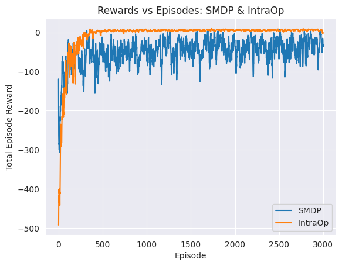

# CS6700 Programming Assignment 3: Hierarchical Reinforcement Learning (Taxi Domain)

[](requirements.txt) <!-- Update Python version if known -->
<!-- [](LICENSE) --> <!-- Optional: Add license badge if you add a LICENSE file -->

An implementation and comparison of **SMDP Q-Learning** and **Intra-Option Q-Learning** algorithms for solving the **Taxi Domain** problem using **OpenAI Gymnasium**.

---

## 🧪 Objectives

1.  **Implement SMDP Q-Learning:** Develop and apply the single-step Semi-Markov Decision Process (SMDP) Q-Learning algorithm to the Taxi Domain.
2.  **Implement Intra-Option Q-Learning:** Develop and apply Intra-Option Q-Learning using a defined set of options within the Taxi Domain.
3.  **Analyze & Compare:**
    *   Plot reward curves for both algorithms to visualize learning progress.
    *   Visualize the learned Q-values for key state-action pairs or options.
    *   Provide written descriptions of the learned policies or option behaviors.
4.  **Experiment:** Implement and evaluate an alternate set of options for Intra-Option Q-Learning and compare its performance against the initial set.

---

## 📋 Table of Contents

1.  [Overview](#📝-overview)
2.  [Environment: Taxi Domain](#🚕-environment-taxi-domain)
3.  [Algorithms Implemented](#⚙️-algorithms-implemented)
4.  [Project Structure](#🗂️-project-structure)
5.  [Setup & Installation](#🚀-setup--installation)
6.  [Usage](#▶️-usage)
7.  [Results](#📊-results)
8.  [Contributing](#🤝-contributing)
9.  [License](#📜-license)

---

## 📝 Overview

This project explores Hierarchical Reinforcement Learning (HRL) techniques by implementing and comparing two key algorithms:

*   **SMDP Q-Learning:** Learns values for actions over extended periods defined by options.
*   **Intra-Option Q-Learning:** Learns policies *within* options simultaneously with learning values over options.

The goal is to understand their learning dynamics, performance differences, and the impact of option design in the classic Taxi Domain environment.

---

## 🚕 Environment: Taxi Domain

*   **Grid Size:** 5x5
*   **Task:** Pick up a passenger from one of four designated locations (R, G, B, Y) and drop them off at another.
*   **States:** 500 discrete states representing taxi location (row, col), passenger location (in taxi or at R, G, B, Y), and destination (R, G, B, Y).
*   **Actions:** 6 discrete actions (Move North, South, East, West, Pickup, Dropoff).
*   **Rewards:**
    *   `-1` per step.
    *   `+20` for successful drop-off.
    *   `-10` for illegal pickup/dropoff.
*   **Discount Factor (γ):** 0.9
*   **Reference:** [Gymnasium Taxi-v3 Documentation](https://gymnasium.farama.org/environments/toy_text/taxi/)

---

## ⚙️ Algorithms Implemented

### 1. SMDP Q-Learning

This algorithm learns the value function Q(s, o) for initiating an option *o* in state *s*. It uses the Bellman equation adapted for options, considering the cumulative discounted reward and duration of executing an option.

### 2. Intra-Option Q-Learning

This approach learns Q(s, a) for primitive actions *a* within the context of an active option *o*. It allows for learning and improving the internal policies of options while the agent interacts with the environment. It typically involves learning both the option values Q(s, o) and the intra-option values Q(s, a).

*(Add more specific details about your implementation choices, option definitions, etc., here or link to the relevant code/notebook sections)*

---

## 🗂️ Project Structure

```
CS6700-PA3-HRL-Taxi/
├── .gitignore
├── README.md
├── requirements.txt
├── notebooks/
│   └── hrl_taxi_domain_analysis.ipynb  # Main notebook for implementation, experiments & visualization
├── src/                                # Source code (optional, if refactored)
│   ├── __init__.py
│   ├── agents/
│   │   ├── __init__.py
│   │   ├── smdp_q_learning.py
│   │   └── intra_option_q_learning.py
│   ├── envs/
│   │   └── __init__.py
│   ├── options/
│   │   ├── __init__.py
│   │   └── taxi_options.py             # Option definitions
│   └── utils/
│       └── __init__.py
├── results/
│   ├── plots/                          # Generated plots
│   │   ├── smdp_q_learning_rewards.png
│   │   ├── intra_option_q_learning_rewards.png
│   │   └── comparison_plot.png
│   └── q_values/                       # Saved Q-value visualizations
│       ├── smdp_q_values.png
│       └── intra_option_q_values.png
├── docs/
│   ├── CS6700_PA3.pdf                  # Original assignment description
│   └── report.pdf                      # Project report PDF (if applicable)
└── images/                             # Static images (if any)
```

---

## 🚀 Setup & Installation

1.  **Clone the repository:**
    ```bash
    # Replace with your actual repository URL
    git clone https://github.com/your-username/CS6700-PA3-HRL-Taxi.git
    cd CS6700-PA3-HRL-Taxi
    ```

2.  **Create and activate a virtual environment (recommended):**
    ```bash
    python3 -m venv venv
    source venv/bin/activate  # On Windows use `venv\Scripts\activate`
    ```

3.  **Install dependencies:**
    ```bash
    pip install -r requirements.txt
    # Ensure requirements.txt includes: gymnasium, numpy, matplotlib, etc.
    ```

---

## ▶️ Usage

All implementation, experiments, and visualizations are primarily conducted within the Jupyter notebook:

1.  Navigate to the `notebooks` directory:
    ```bash
    cd notebooks
    ```
2.  Launch Jupyter Lab or Jupyter Notebook:
    ```bash
    jupyter lab
    # or
    # jupyter notebook
    ```
3.  Open `hrl_taxi_domain_analysis.ipynb` and execute the cells sequentially.

*(Optional: If you create separate training scripts in `src/`, provide command-line usage examples here.)*

---

## 📊 Results

Performance comparison plots (e.g., rewards per episode) and Q-value visualizations are generated by the notebook and saved in the `results/` directory.

*(Embed key result plots here for quick viewing)*

**Reward Curves Comparison**

 <!-- Replace with your actual comparison plot -->

**Summary of Findings:**

*(Add 1-2 sentences summarizing the key observations from the results, e.g., comparing convergence speed, final performance, and the impact of different option sets between SMDP Q-Learning and Intra-Option Q-Learning.)*

*(Refer to the `docs/report.pdf` or the analysis notebook for detailed results and discussion.)*

---

## 🤝 Contributing

This repository is intended for an academic assignment. Contributions are generally not expected. However, feel free to open an issue if you find bugs or have suggestions.

---

## 📜 License

*(Optional: Specify the license. Create a LICENSE file if needed.)*

<!-- This project is licensed under the MIT License - see the [LICENSE](LICENSE) file for details. -->

